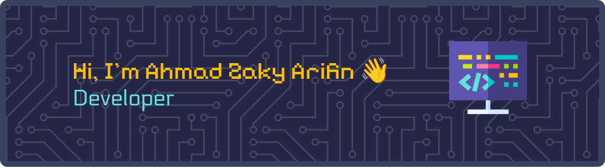

<!-- Banner -->

  

<!-- Skills Section -->
<h4 align="center" style="margin-top: 30px;">🛠️ Skills</h4>

<!-- Know the Basics -->

  <h5 align="center">✨ Know the Basics</h5>
  

    
    
    
    
    
    
  

  <!-- Learning & Using -->
  

    <h5 align="center">🌱 Learning & Using</h5>
    

      
      
      
      
    

  

<!-- Connect with me -->
<h5 align="center" style="margin-top: 30px;">📫 Connect with me</h5>

  
  

<!-- GitHub Stats -->
<h5 align="center" style="margin-top: 30px;">📊 My GitHub Stats</h5>

  

<h5 align="center" style="margin-top: 30px;">🎮 Play Games with me</h5>

  

